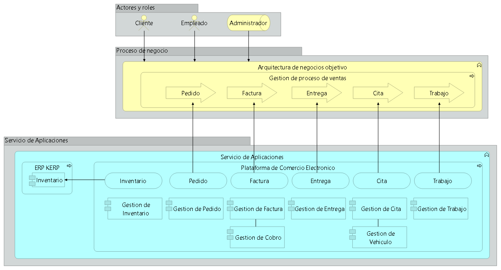

# Información del estudiante
#### Nombre: Jimmy Javier García Almeida
#### Correo: jjgarcia6@utpl.edu.ec

#  Información de la empresa

## Nombre: ABC Motor ABCM 
### Actividad económica: 
Comercio al por mayor y al por menor; reparación de vehículos automotores y motocicletas.
#### Descripción: 
ABC Motor ABCM, es una empresa que se dedica al comercio al por mayor y menor de productos automotrices entre los que destaca la comercialización de llantas, baterías y aceites.

La propuesta planteada se enfoca en proporcionar para el segmento del comercio al por menor, una herramienta de eccommerce para la venta de sus productos en internet.

La arquitectura de aplicaciones objetivo es: 


#### En el presente proyecto se muestra como sería el portal web de la solución propuesta.

# Instalación

Para instalar se debe hacer:

1) Fork del repositorio
2) Ejecutar npm install
3) Ejecutar npm i react-icons@4.10.1
4) Ejecutar npm run dev

# Despliegue 

La aplicación esta desplegada en Vercel https://cart-app-nine-eta.vercel.app/ con la autenticacion Oauth 2.0 de Google activa.

# Autenticación Google

En este repositorio falta el archivo .env.local con las llaves de autenticación, para generarlas ir a https://console.cloud.google.com/apis escoger la opción: 

1) Credenciales -> Crear Credenciales -> ID de cliente Oauth
2) Tipo de aplicación: Aplicación web
3) Nombre: Algún nombre para identificar la autenticación
4) URIs de redireccionamiento autorizados: URL de sitio web seguido de /api/auth/callback/google 
#### Ejemplo: http://localhost:3000/api/auth/callback/google 

# Archivo .env.local

Crear un archivo .env.local en el root del proyecto, con las siguientes variables y la informacion de las credenciales

```bash
GOOGLE_CLIENT_ID= de google
GOOGLE_CLIENT_SECRET= de google
NEXTAUTH_URL= URL sin /api/auth/callback/google
```
```bash
Ejemplo:  NEXTAUTH_URL=http://localhost:3000/
```

Para despliegue en Vercel, sugiero generar otra autenticación adicional(repetir los pasos anteriores) y subir estas claves en Variables de Entorno y una variable adicional que la generan desde una terminal git bash con el comando 

```bash
openssl rand -base64 32
```
```bash
NEXTAUTH_SECRET=Secreto generado
```

Sin esta variable no funciona la autenticacion Google en Vercel

Gracias por la atención prestada 

Jimmy


# Next.js & HeroUI Template

This is a template for creating applications using Next.js 14 (app directory) and HeroUI (v2).

[Try it on CodeSandbox](https://githubbox.com/heroui-inc/heroui/next-app-template)

## Technologies Used

- [Next.js 14](https://nextjs.org/docs/getting-started)
- [HeroUI v2](https://heroui.com/)
- [Tailwind CSS](https://tailwindcss.com/)
- [Tailwind Variants](https://tailwind-variants.org)
- [TypeScript](https://www.typescriptlang.org/)
- [Framer Motion](https://www.framer.com/motion/)
- [next-themes](https://github.com/pacocoursey/next-themes)

## How to Use

### Use the template with create-next-app

To create a new project based on this template using `create-next-app`, run the following command:

```bash
npx create-next-app -e https://github.com/heroui-inc/next-app-template
```

### Install dependencies

You can use one of them `npm`, `yarn`, `pnpm`, `bun`, Example using `npm`:

```bash
npm install
```

### Run the development server

```bash
npm run dev
```

### Setup pnpm (optional)

If you are using `pnpm`, you need to add the following code to your `.npmrc` file:

```bash
public-hoist-pattern[]=*@heroui/*
```

After modifying the `.npmrc` file, you need to run `pnpm install` again to ensure that the dependencies are installed correctly.

## License

Licensed under the [MIT license](https://github.com/heroui-inc/next-app-template/blob/main/LICENSE).
